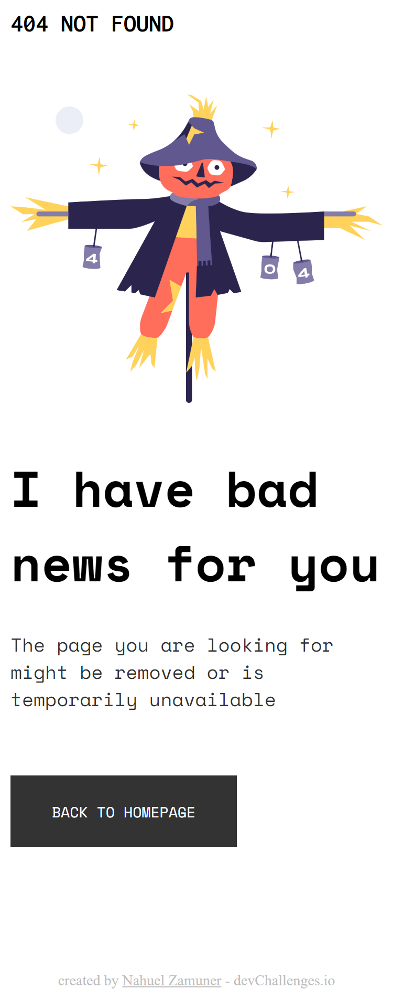

# 404PageChallenge

Solution for a challenge from [Devchallenges.io](http://devchallenges.io)

<h2>Links</h2>

* [Demo](https://www.figma.com/file/QeKWLNhB13zDjJzqR22TKE/404-page-challenge)
* [Solution](https://github.com/NahuelZamuner/404PageChallenge/)
* [Challenge](https://devchallenges.io/challenges/wBunSb7FPrIepJZAg0sY)

<h2>Overview</h2>
Responsive 404 error page. It was a good experience creating this 404 error view, quite minimalist with a nice design.

<h2>Built with:</h2>

* HTML5
* CSS3

<h2>Features</h2>
The objective of the page is to redirect to the home of origin with an anchor button.

The page also has anchor buttons that direct to the developer profile on GitHub and to the challenge site.

<h2>Contact</h2>

* nahuelzamuner010@gmail.com

<h2>Thanks</h2>

Thanks to the dev Challenge community for the UI layout provided for the project. They are very useful to put our knowledge into practice.

